# Screenshots

These screenshots come from a VM test build of Aero7-shell. They document the installed desktop experience and are not installable runtime assets.

## Desktop

| Desktop overview | Lock screen |
| --- | --- |
| 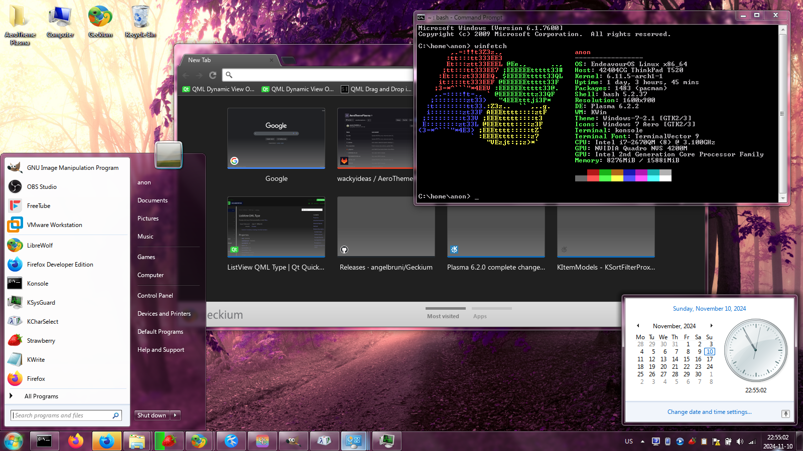 | 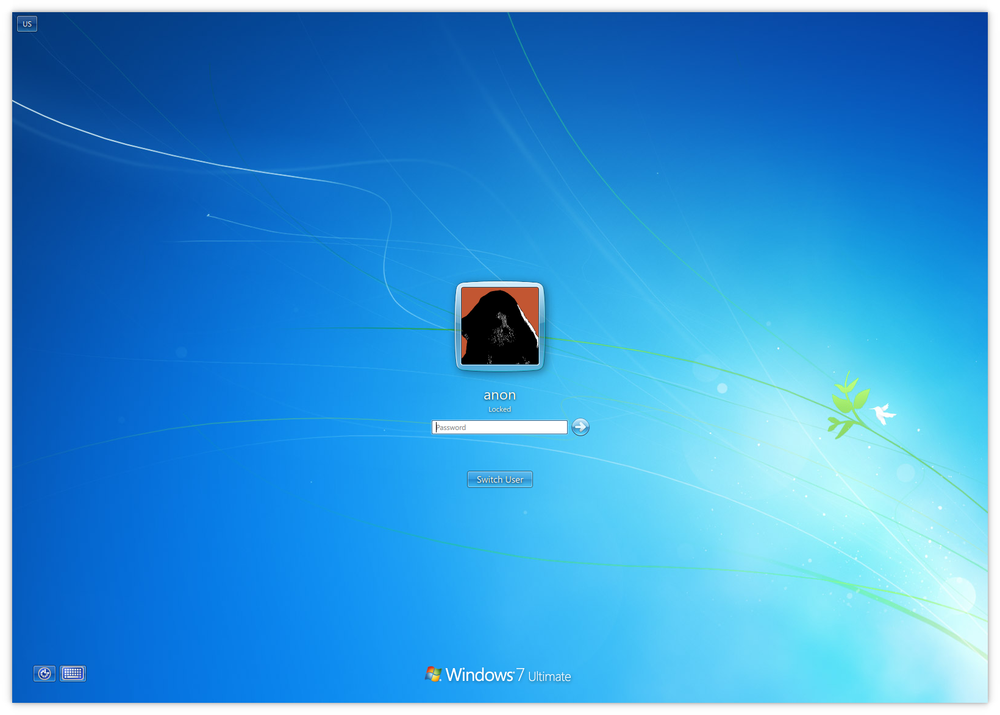 |

## Shell

| Start menu | Compact taskbar grouping |
| --- | --- |
| 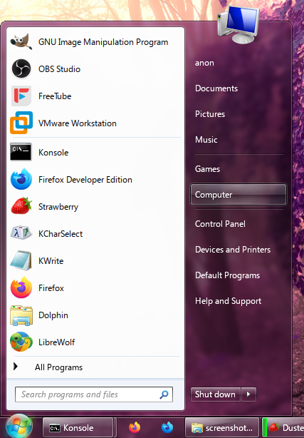 | 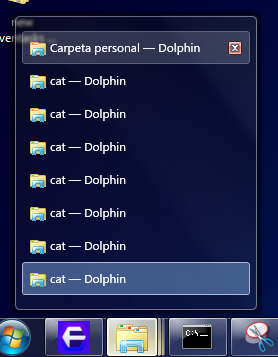 |

| Jump list | Notification |
| --- | --- |
| 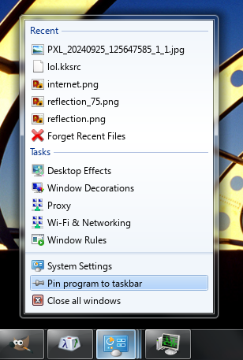 | 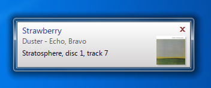 |

## System Popups

| Authentication prompt | Network details |
| --- | --- |
| 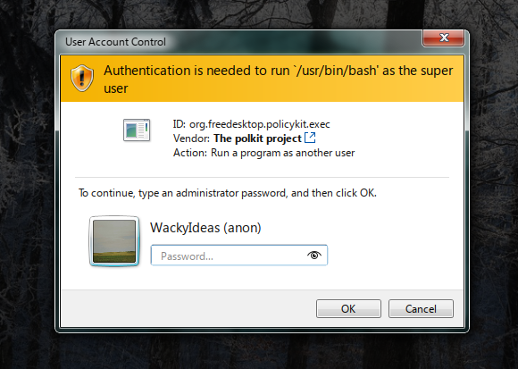 | 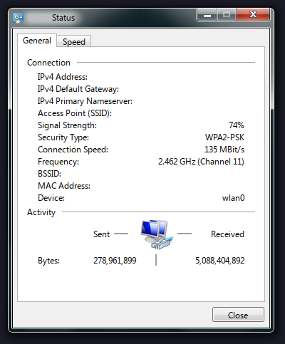 |

| Battery | Clock | Mixer |
| --- | --- | --- |
| 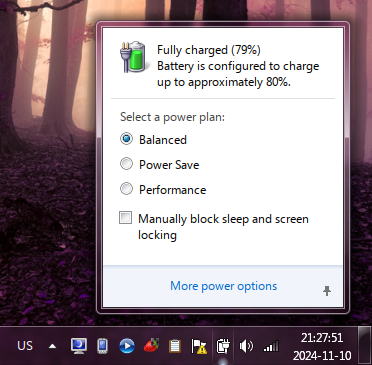 | 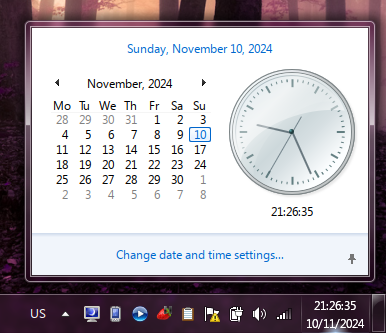 | 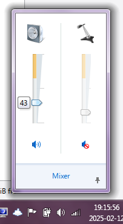 |

## Extras

| Gadgets | Icons |
| --- | --- |
| 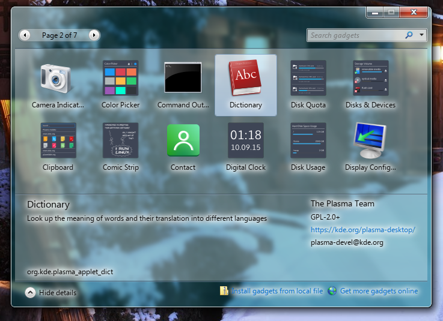 | 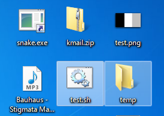 |
