# Screenshots

These screenshots document a clean Aero7 installation after first-login setup.
They show the current installed desktop and are not reusable runtime artwork.

## Desktop

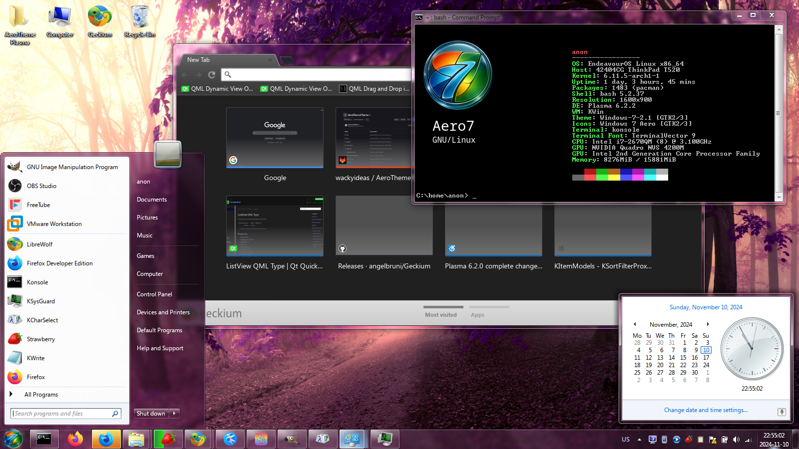

| Start menu | All Programs |
| --- | --- |
| 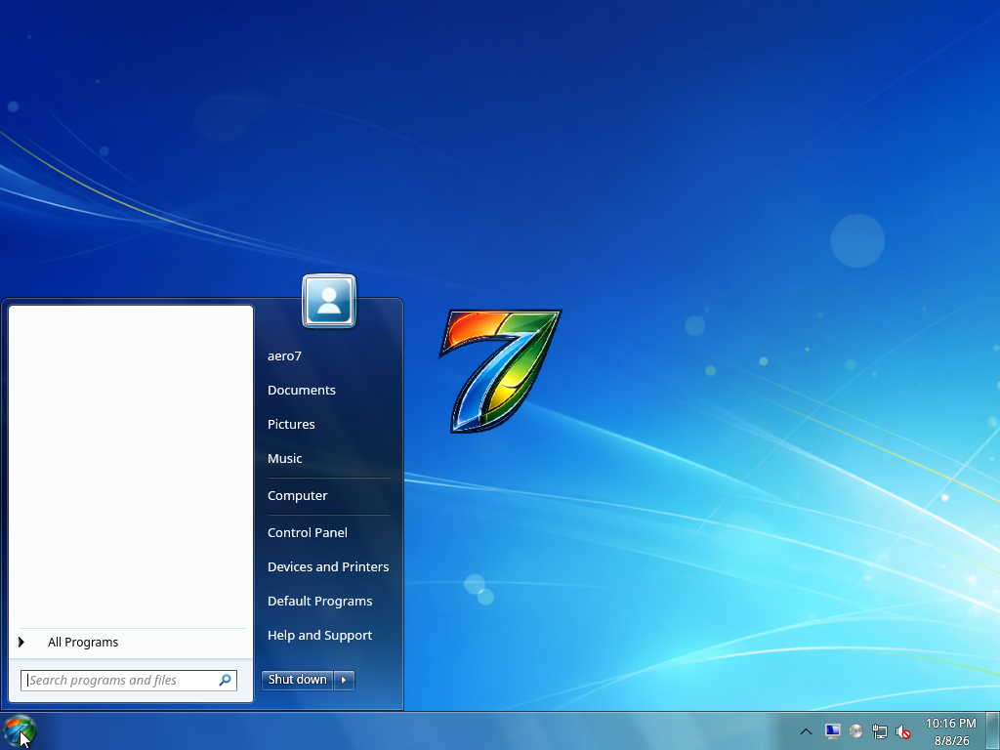 | 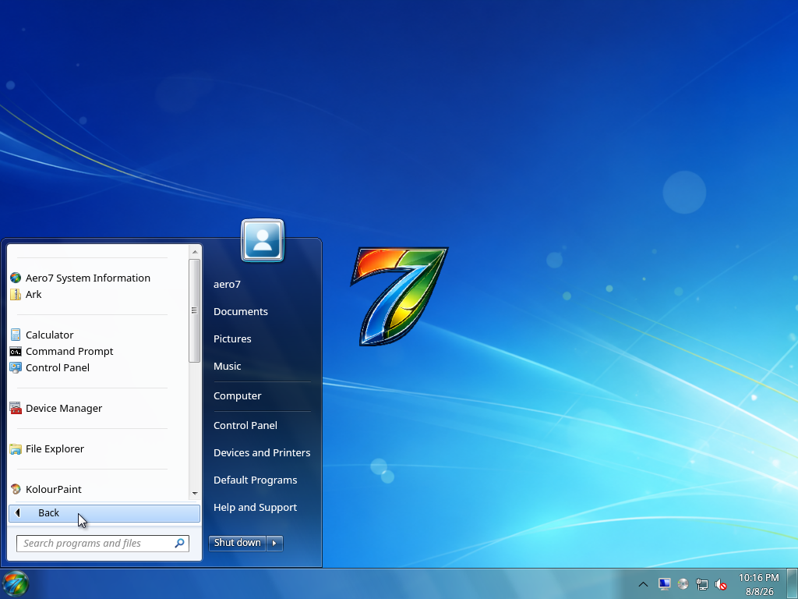 |

| Desktop menu | Jump list |
| --- | --- |
| 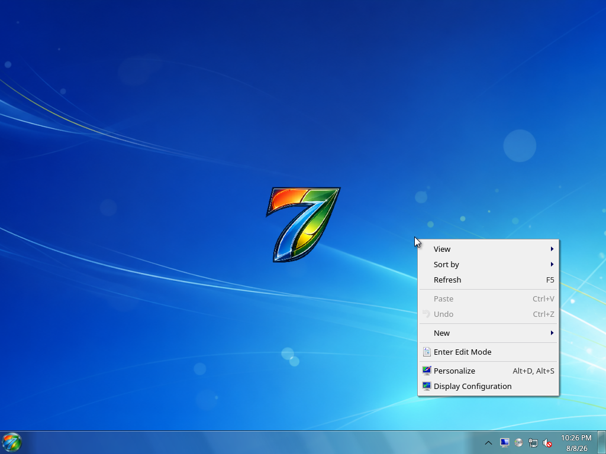 |  |

## System popups

| Authentication | Lock screen |
| --- | --- |
|  | 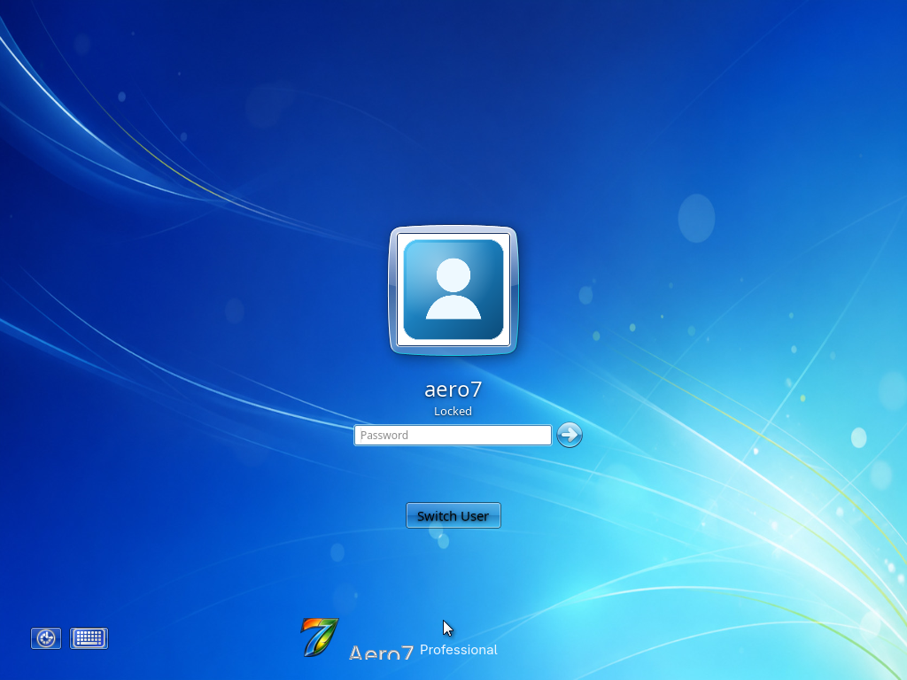 |

| Clock | Network | Volume |
| --- | --- | --- |
|  |  | 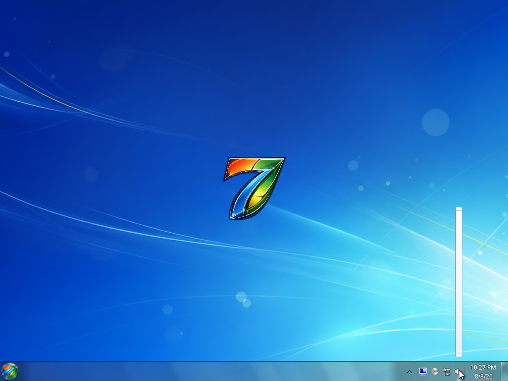 |

## Applications

| File Explorer | Photo Viewer |
| --- | --- |
| 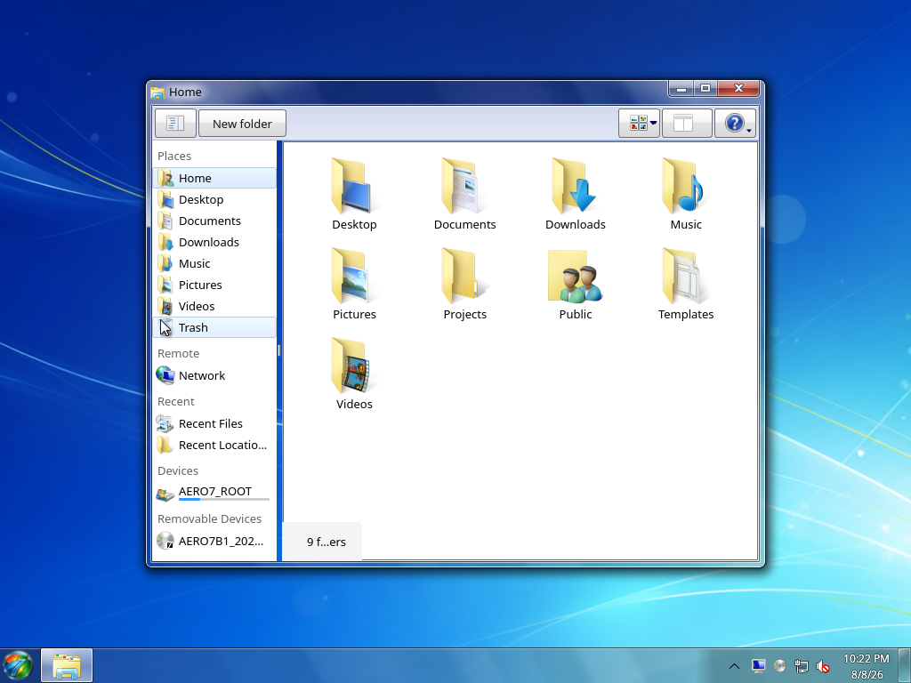 | 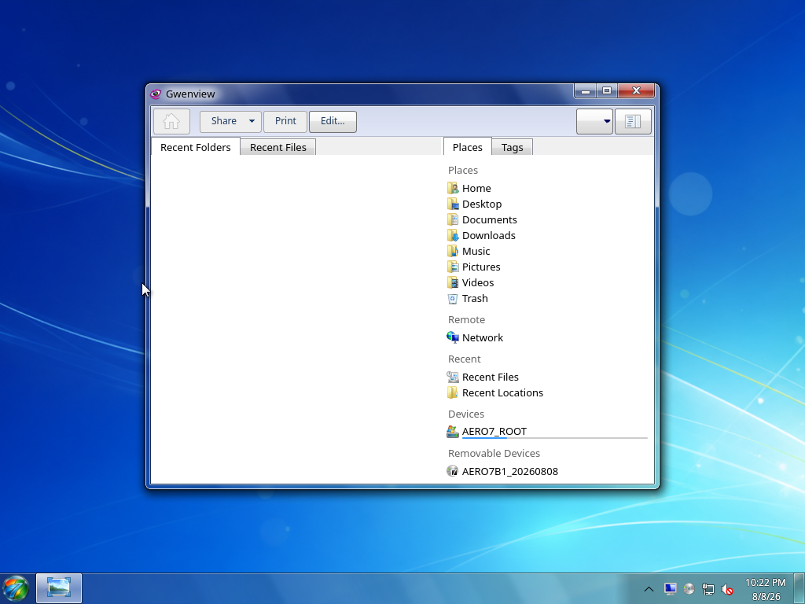 |

| Control Panel | Device Manager |
| --- | --- |
|  | 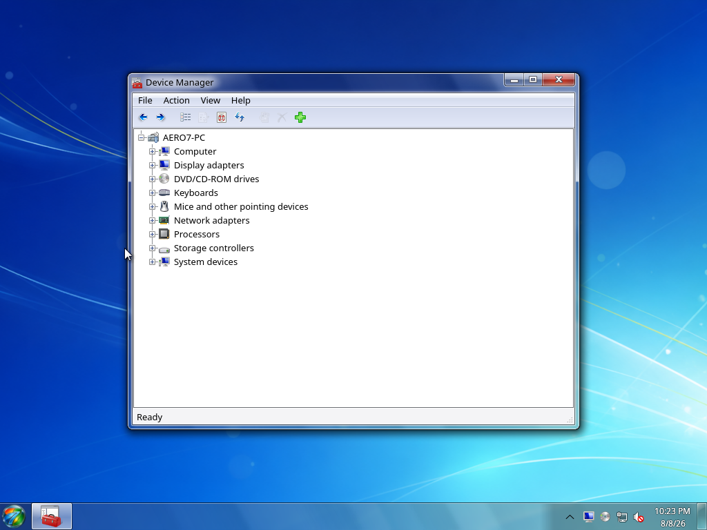 |

| Command Prompt | Task Manager |
| --- | --- |
| 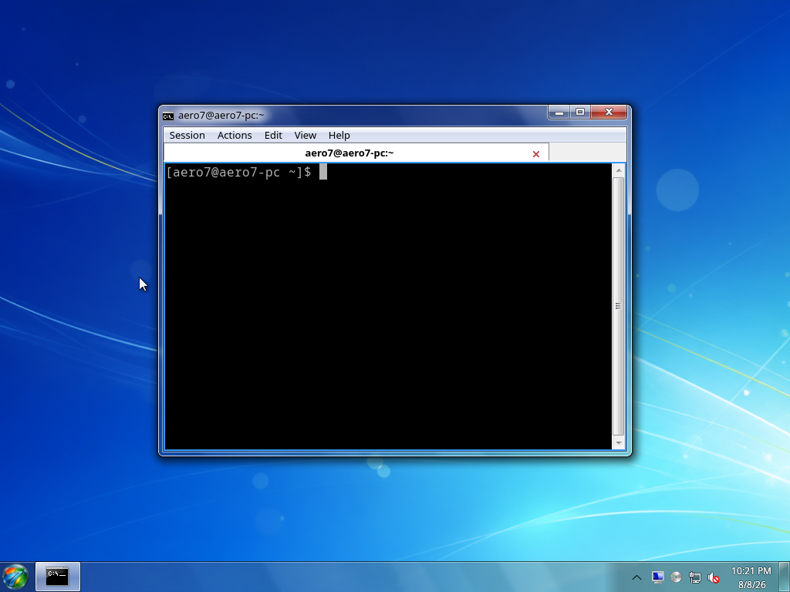 | 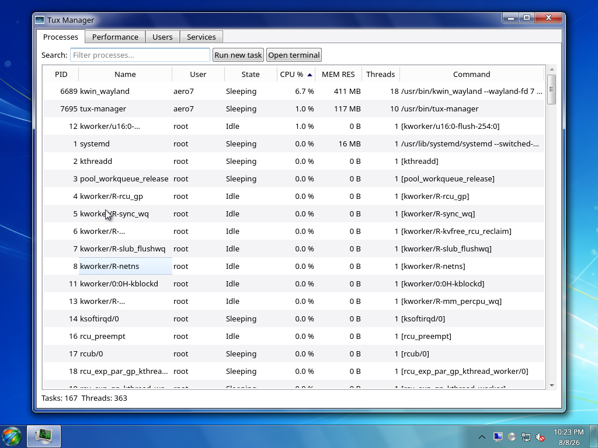 |

| Media Player | Notepad |
| --- | --- |
|  |  |

| Calculator | Paint |
| --- | --- |
| 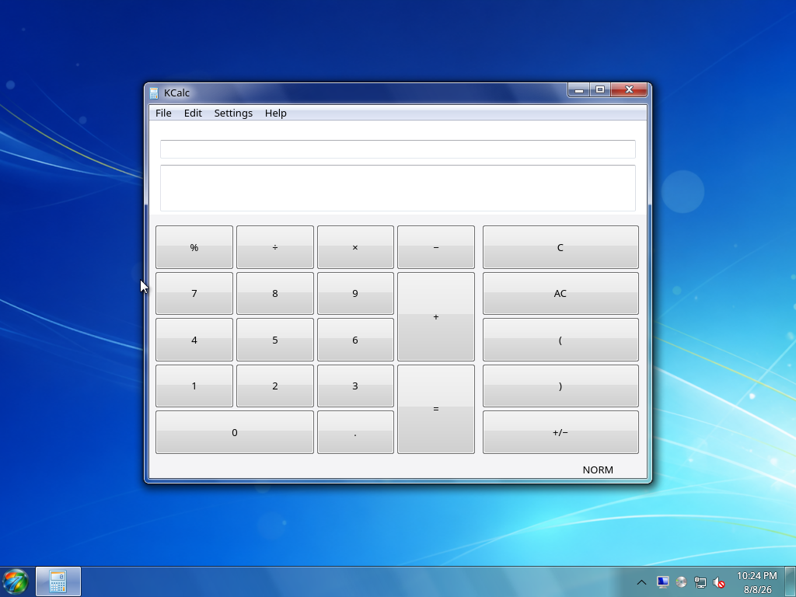 |  |

| Archive Manager | System Information |
| --- | --- |
|  |  |

The Snipping Tool performs a background region capture directly to the
clipboard and therefore has no persistent application window to show here.
